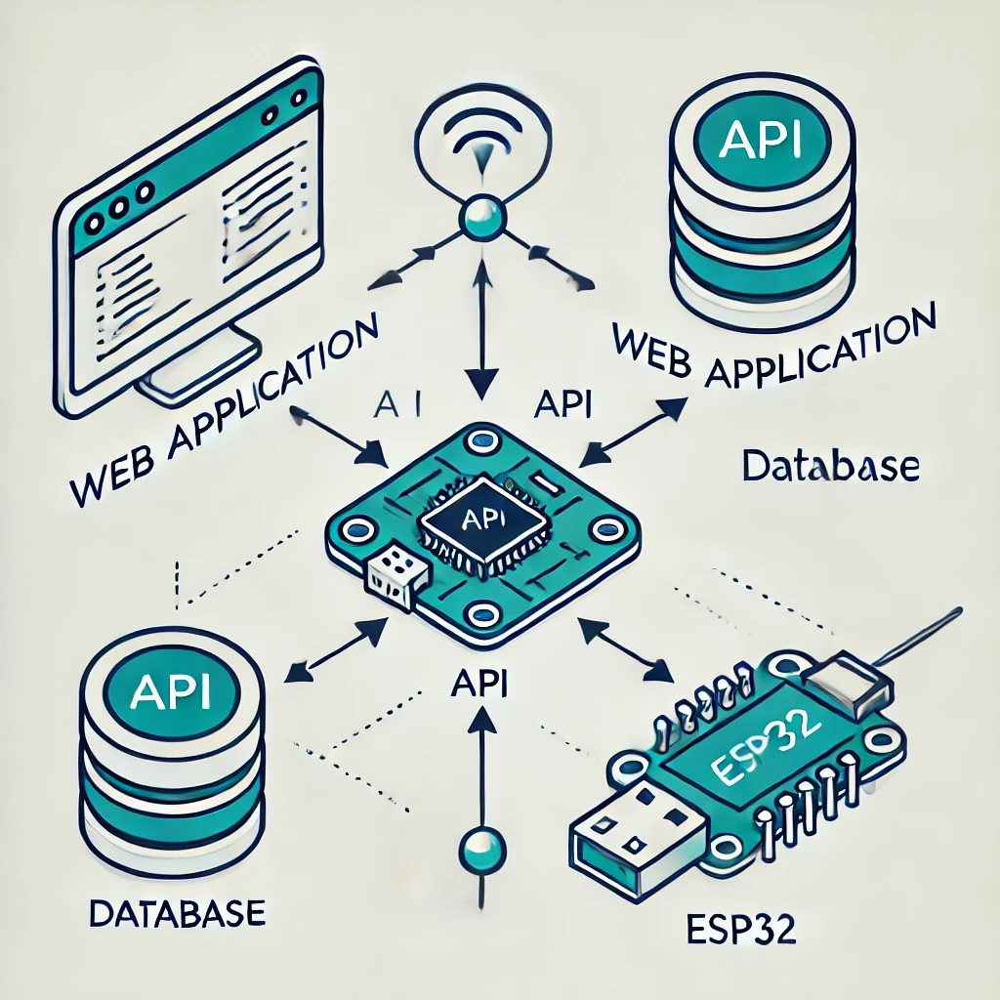

# Desenvolvimento de Aplicações Web para Fábricas Inteligentes: Explorando o Potencial do Python e dos Dispositivos da Internet das Coisas (IoT)

Este projeto de Iniciação Científica, desenvolvido no Instituto Federal do Espírito Santo (IFES), busca explorar como tecnologias modernas podem 
transformar processos industriais, com foco no conceito de fábricas inteligentes. A proposta integra dispositivos IoT e soluções baseadas em Python 
para criar sistemas escaláveis, eficientes e alinhados às demandas da Indústria 4.0.

## Objetivo
O principal objetivo do projeto é investigar e demonstrar como a combinação de ferramentas e frameworks em Python, juntamente com dispositivos IoT 
como o ESP32, pode:
- Automatizar processos industriais: Criar sistemas que integram sensores e atuadores para controle e monitoramento em tempo real.
- Otimizar recursos e eficiência: Aplicar tecnologias para melhorar a produtividade e reduzir custos operacionais.
- Promover escalabilidade: Construir soluções flexíveis que atendam a diferentes demandas industriais.
- Aumentar a conectividade: Implementar protocolos modernos de comunicação (como MQTT e HTTP) para uma integração fluida entre sistemas.

## Resultados Esperados
- Desenvolvimento de uma API robusta para comunicação com dispositivos IoT.
- Criação de firmware otimizado para ESP32, responsável por capturar e enviar dados de sensores.
- Um sistema funcional capaz de exemplificar aplicações práticas em fábricas inteligentes, como monitoramento ambiental, controle de máquinas 
ou análise de eficiência.

## Sobre o Repositório
Este repositório contém a documentação central do projeto, com guias técnicos, diagramas de arquitetura e explicações detalhadas das soluções 
desenvolvidas. Para acessar o código-fonte e as implementações práticas:
 - [Repositorio da API](https://github.com/EzequielMarcelo/desenvolvimento-de-aplicacoes-web-para-fabricas-inteligentes-api)
 - [Repositorio do fiwmware](https://github.com/EzequielMarcelo/desenvolvimento-de-aplicacoes-web-para-fabricas-inteligentes-api)